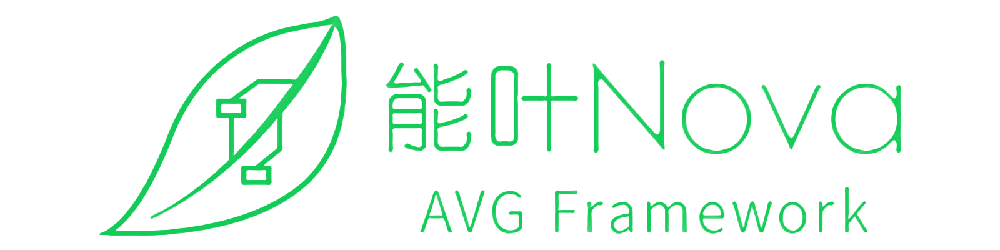

# Nova（能叶）

基于Unity，对程序员友好的视觉小说（VN）/文字冒险游戏（AVG）框架

本框架支持Unity 2018和2019，Windows/Linux/macOS/Android/iOS平台

## 使用说明

文档正在施工中……

* [Todo list](doc/todo.md)

## 友情链接

我们的第一部视觉小说作品《青箱》：[Steam页面](https://store.steampowered.com/app/1131740) [知乎页面](https://www.zhihu.com/question/409724349) [Bangumi页面](https://bgm.tv/subject/311066)

我们的微博：[@LunaticWorks](https://weibo.com/LunaticWorks)

我们的QQ群：876212259，如果以后讨论程序的人多了可能会再开一个程序群
