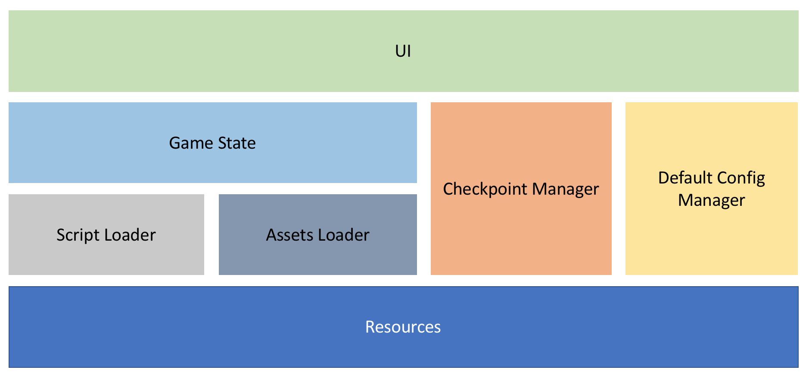

# Nova

Bring the power of Unity to AVG

## Description

This project aims to build a unity package which can speed up AVG game development.

## Program Architecture

Here is a draft of the program architecture, which may change in the future.



## Script Syntax

Just like other AVG engines([renpy](https://www.renpy.org/), [krkrz](https://github.com/krkrz/krkrz)), Nova defines a scripting language to write stories and communicate with game objects. While it will be hard and time consuming to define brand new scripting syntax, [tolua#](https://github.com/topameng/tolua) offers a great way to interact with the Unity Engine using [Lua](https://www.lua.org/), a light weight and powerful programming language. With some minor modifications, the syntax for Nova was born.

Lets see a trivial example to understand how it works.

```lua
@<| label('demo-start', '不速之客'); is_default_start() |>

？？？：大哥哥~~

<| show_background 'the_gate'; pan_backgroud {from = {0.2,0.2}, to = {0.8, 0.8}} |>
站在高耸的城墙上，我无奈地叹了口气

格里尔：这边是精灵的领地，不允许让人类进来。

<| girl:show(); girl:frown(); fix_backgroud() |>
？？？：连可爱的少女都不行么？

格里尔：不要擅自把少女开除人籍啊！

<| girl:frown() |>
？？？：切，不行么。

格里尔：既然自称可爱就不要咂嘴啊！人设都变得奇怪了！

<| girl:frown() |>
？？？：那……怎样才能放我进去呢？

@<| branch {
    {name = '收点好处', destination = 'demo-bad-end'},
    {name = '不放她过去', destination = 'demo-mid'}} |>
@<| label 'demo-mid' |>
真是麻烦啊，这家伙三天前发现了这里，之后每天都会过来喊门。精灵城在森林深处，不知道这个年轻的女孩是如何找到这里的。

得不到回应的少女开始在护城河边晃悠。她对着河里张望，似乎对于里面的东西非常好奇。

<| girl:idle() |>
？？？：呐，河里是不是有什么东西啊？

格里尔：啥？

？？？：你看那边，蓝蓝的，一闪一闪的。

<| show_background 'lake' |>
我定睛看去。因为刚下过雨，护城河的水位比较高。浑浊的河水漫无目的地翻腾着，浪花里隐约能看到蓝色的微光。

格里尔：哦，那个啊。那是底亚翁，不要靠那个太近。

<| girl:question() |>
？？？：底……亚翁？

格里尔：是一种食人鱼的名字啦。这种鱼成群结队的，捕食的时候会发出蓝色的光。它们现在很兴奋的样子，说不定是盯上你了哦。

<| girl:shock() |>
？？？：这种鱼还会想要捕食岸上的人的么？

格里尔：要是掉到河里不到五分钟就会被吃得只剩下骨架了哦！

<| girl:shock() |>
？？？：哇，不要说这么吓人的话呀！

少女赶紧后退了几步。

格里尔：不过这种鱼其实视力很差，是看不到岸上的人的。可能今天比较特殊……恩？

在那一瞬间，浪花之中显现出了令人在意的东西。

虽然时间很短，但是我绝对不会看错。

那是我熟悉的少女的部分，那是我曾经发誓需要保护的人的残躯。

格里尔：安洁！！

@<| jump_to 'demo-mid-2' |>

@<| label 'demo-bad-end' |>
这样真的好么？

作为骄傲的精灵族的一员，这样自甘堕落，真的没问题么？
@<| is_end '自我拷问' |>
```
OK, this is just a demo. It might be better if I could have written that in English, but I'm not a native English speaker, and I don't believe this piece of boring story will attract you :(

As you can see, alongside with normal story contents(those Chinese text), there are two special blocks: `@<| some code |>` and `<| some code |>`. inside which are **pure lua code**! The difference between these two blocks is the timing of execution.

Codes inside `@<| ... |>`, let's call it fast execution block, are executed at the script loading time. Codes inside fast execution blocks usually supply important information for the building of the game play flow chart. You can use built in functions like label, branch to define your own graph.

`<| ... |>`, which we call lazy execution blocks, are wrapped as functions and stored on the corresponding positions on the flow chart. Codes inside it can be executed when the player enter these positions as the game play proceeds. Lazy execution blocks are good places to put codes that directly interacts with game objects, like making a girl smile, changing background images, etc.

We does not constrain how the text is written. Only one thing should be noticed: text contents are divided in to entries by empty lines. For example, this is two entries:

```lua
<| girl:shock() |>
？？？：这种鱼还会想要捕食岸上的人的么？

格里尔：要是掉到河里不到五分钟就会被吃得只剩下骨架了哦！
```

This is three entries:

```lua
<| girl:shock() |>

？？？：这种鱼还会想要捕食岸上的人的么？

格里尔：要是掉到河里不到五分钟就会被吃得只剩下骨架了哦！
```

Text contents are stored as lists of entries under each flow chart node.

Nova will supply some built in functions that can be called inside execution blocks. For now, already implemented functions are:

+ Called inside fast execution blocks
    + `label`
    + `jump_to`
    + `branch`
    + `is_start`
    + `is_default_start`
    + `is_end`
+ Called inside lazy execution blocks
    + nothing has been implemented yet

**WARN**: under current implementation, don't put `@<|`,`<|`,`|>` inside execution blocks.

## For Developers

All codes of Nova lies inside `Assets/Nova`. These codes are all heavily documented.

## TODO

+ Implementation of all parts
+ The specification of the checkpoint file format.
+ The specification of the default config file format.
